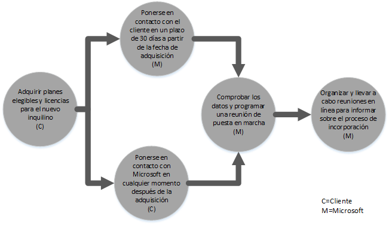
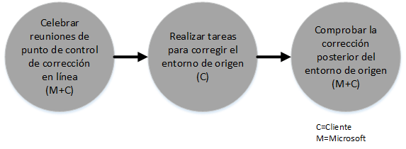
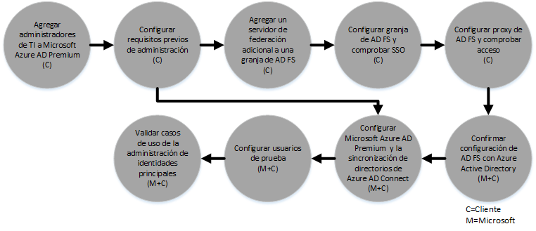

# Proceso del beneficio del Centro de FastTrack para Azure Active Directory Premium 
Si su organización es apta para poder beneficiarse de las oportunidades que ofrece el Centro FastTrack para Microsoft Azure AD Premium, podrá trabajar de forma remota con especialistas de Microsoft que le ayudarán a preparar su entorno de Microsoft Azure AD Premium. Para saber si su organización es apta, consulte [Beneficio del Centro de FastTrack para Azure Active Directory Premium](../Topic/FastTrack_Center_Benefit_for_Azure_Active_Directory_Premium.md).

Este artículo ofrece lo siguiente:

-   [Overview of the onboarding process](#overview)

-   [Expectations for your source environment](#expectations_src_environ)

-   [Phases of the onboarding process](#phases_onboarding_process)

-   [Microsoft responsibilities](#microsoft_responsibilities) de cada fase

-   [Your responsibilities](#your_responsibilities) de cada fase

Esto es lo que puede esperar cuando se complete la incorporación:

-   Se creará su inquilino de Microsoft Azure AD Premium.

-   Los usuarios con licencia podrán acceder a los servicios de Microsoft Azure AD Premium mediante una de las siguientes opciones de identidad:

    -   Identidades de nube (cuentas de Microsoft Azure AD Premium únicas).

    -   Identidades sincronizadas: son cuentas de Microsoft Azure AD Premium sincronizadas desde su cuenta de Active Directory local mediante la herramienta Azure Active Directory Connect (Azure AD Connect) para clientes que posean un único bosque o con varios bosques de Active Directory.

    -   Identidades federadas--con cuentas de Microsoft Azure AD Premium:

        -   Sincronizadas desde Active Directory con la herramienta de Microsoft Azure AD Connect para clientes con una única configuración de bosque de Active Directory.

        -   Federadas con Servicios de federación de Active Directory (AD FS) 2.0 o posteriores de su Active Directory local.

## Información general sobre el proceso de incorporación
La incorporación presenta dos componentes principales:

-   **Capacidades principales**: tareas necesarias para la configuración de inquilinos e integración con Azure AD, si es necesario. Las capacidades principales también proporcionan la base para incorporar otros servicios válidos de Microsoft Online.

-   **Incorporación de servicio**: tareas necesarias para configurar Microsoft Azure AD Premium independiente o con la sincronización de directorios de Azure AD Connect o AD FS.

En el siguiente diagrama se describe la escala de tiempo para usar las prestaciones que ofrece el Centro FastTrack.

El proceso básico es el siguiente:

-   El equipo de Microsoft intentará ponerse en contacto con usted en un plazo de 30 días a partir de la fecha de compra de un plan válido. También puede solicitar asistencia desde el [Centro de FastTrack](http://fasttrack.microsoft.com/) si está listo para implementar estos servicios para su organización. Para solicitar asistencia, inicie sesión en el Centro de FastTrack (http://fasttrack.microsoft.com), vaya al panel, seleccione el nombre de su empresa, haga clic en la pestaña Ofertas y haga clic en el botón correspondiente para solicitar asistencia del servicio pertinente. Cuando empiece el soporte técnico de incorporación, configuraremos una programación de reuniones en línea.

-   El equipo de Microsoft le ayudará con las capacidades principales y a incorporar cada uno de los servicios aptos.

Todo el soporte técnico de incorporación lo proporcionará de forma remota el personal asignado de Microsoft:

-   Microsoft le ayudará de forma remota con las distintas actividades de incorporación mediante una combinación de herramientas, documentación e instrucciones. Si desea que Microsoft realice ciertas tareas de configuración para usted, puede proporcionar permisos y el acceso apropiado a Microsoft para llevar a cabo estas tareas.

-   El soporte técnico de incorporación lo ofrece el Centro de FastTrack y está disponible durante el horario comercial de una región específica.

-   El soporte técnico de incorporación está disponible en chino tradicional, inglés, francés, alemán, italiano, japonés, portugués (Brasil) y español.

-   El equipo de Microsoft puede trabajar directamente con usted o a través de su representante.

## Expectativas para su entorno de origen
Es posible que ya disponga de Microsoft Active Directory de forma local en el entorno de origen que desee integrar con Microsoft Azure AD Premium para aprovechar la administración de identidades enriquecidas desde una sola consola. Entre las prestaciones que ofrece el Centro FastTrack se incluye, entre otras cosas, la ayuda para integrar Microsoft Azure AD Premium con la implementación local existente. Si se requiere la integración, el entorno de origen debe estar en un nivel mínimo de la aplicación.

En la tabla siguiente se muestran las expectativas del entorno de origen existente para la incorporación.

|Actividad|Expectativa del entorno de origen|
|-------------|-------------------------------------|
|Capacidades principales|Bosques de Active Directory con el nivel funcional del bosque establecido en Windows Server 2008 o posterior, con la siguiente configuración de bosque:  -   Un único bosque de Active Directory -   Varios bosques de Active Directory **Note:** Para todas las configuraciones de bosques múltiples, la implementación de AD FS no se incluye en las prestaciones del Centro FastTrack.|
|Incorporación de servicio  -   Microsoft Azure AD Premium|Active Directory local y el entorno se han preparado para Azure AD Premium, que incluye la corrección de los problemas identificados que podrían impedir la integración con funcionalidades de Azure AD y Azure AD Premium.|

## Fases del proceso de incorporación
La incorporación de Microsoft Azure AD Premium tiene cinco fases principales, tal como se muestra en la ilustración siguiente:

-   Inicio

-   Evaluación

-   Corrección

-   Habilitar

-   Cerrar

Para conocer las tareas detalladas de cada fase, consulte las secciones [Microsoft responsibilities](#microsoft_responsibilities) y [Your responsibilities](#your_responsibilities).

### Fase de inicio
Una vez haya adquirido el número adecuado de licencias, siga las instrucciones que encontrará en el correo electrónico de confirmación de compra para asociar las licencias a un inquilino existente o a un nuevo inquilino. Microsoft comprobará si cumple los requisitos para optar a las prestaciones que ofrece el Centro FastTrack. El equipo de Microsoft intentará ponerse en contacto con usted en un plazo de 30 días a partir de la fecha de compra de un plan válido. También puede solicitar asistencia desde el [Centro de FastTrack](http://fasttrack.microsoft.com/) si está listo para implementar estos servicios para su organización. Para solicitar asistencia, inicie sesión en el Centro de FastTrack (http://fasttrack.microsoft.com), vaya al panel, seleccione el nombre de su empresa, haga clic en la pestaña Ofertas y haga clic en el botón correspondiente para solicitar asistencia del servicio pertinente. Cuando empiece el soporte técnico de incorporación, configuraremos una programación de reuniones en línea.

Durante esta fase, explicaremos el proceso de incorporación, comprobaremos los datos y convocaremos una reunión de puesta en marcha.

### Fase de evaluación
Una vez iniciado el proceso de incorporación, Microsoft trabajará con usted para evaluar su entorno de origen y los requisitos. Se ejecutarán herramientas para evaluar su entorno y Microsoft le ayudará a evaluar su Active Directory local, exploradores de Internet, sistemas operativos de dispositivos cliente, DNS, red, infraestructura y sistema de identidad para determinar si se requieren cambios para la incorporación. Según la configuración actual, le presentaremos un plan de corrección para que su entorno de origen reúna los requisitos mínimos para incorporar correctamente Microsoft Azure AD Premium. También programaremos llamadas de control pertinentes durante la fase de corrección.

### Fase de corrección
Si es necesario, realizará las tareas del plan de corrección en su entorno de origen para cumplir los requisitos de incorporación de cada servicio.

Antes de comenzar la fase de habilitación, comprobaremos juntos los resultados de las actividades de corrección para asegurarnos de que está listo para continuar.

### Fase de habilitación
Cuando complete todas las actividades de corrección, el proyecto pasará a la configuración de la infraestructura básica de consumo del servicio y al aprovisionamiento de Microsoft Azure AD Premium.

**Habilitar la fase: capacidades principales**

Habilitar las capacidades principales implica el aprovisionamiento del servicio y la integración de inquilinos e identidades. También incluye los pasos para establecer una base para incorporar Microsoft Azure AD Premium.

La incorporación de Microsoft Azure AD Premium puede empezar cuando haya finalizado la incorporación principal.

**Fase de habilitación: Microsoft Azure AD Premium**

Según sea necesario, el entorno de Microsoft Azure AD Premium puede configurarse con la sincronización de directorios de Azure AD Connect y los Servicios de federación de Active Directory (AD FS).

Para los escenarios de Microsoft Azure AD Premium que incluyen la sincronización de identidades locales en la nube, le ayudaremos mediante la adición de usuarios y administradores de TI a su suscripción, la configuración de los requisitos previos de administración, la configuración de Microsoft Azure AD Premium, la configuración de la sincronización de directorios con Azure AD Connect y Servicios de federación de Active Directory usando Azure AD Connect, la configuración de usuarios de prueba y la validación de sus principales casos de uso para el servicio.

El programa de instalación de Microsoft Azure AD Premium incluye las siguientes funciones:

-   Restablecimiento de la contraseña de autoservicio (SSPR)

-   Azure Multi-factor Authentication (MFA)

-   Aplicación de Software como servicio (SaaS): configurar una aplicación de SaaS

-   Administración de grupos de autoservicio (SSGM)

-   Informes administrativos

## Responsabilidades de Microsoft

### General

-   Proporcionar asistencia remota para las actividades de configuración necesarias, como se explica en las descripciones detalladas de cada fase.

-   Proporcionar la documentación y las herramientas de software, las consolas de administración y los scripts necesarios para ayudarle a reducir o eliminar las tareas de configuración.

No es necesario proporcionar acceso y permisos a Microsoft para poder usar las prestaciones del Centro FastTrack. En algunos casos, puede facilitar a Microsoft el acceso y permisos adecuados para realizar actividades específicas en su nombre.

### Fase de inicio

-   Ponerse en contacto con usted en un plazo de 30 días a partir de la compra de licencias aptas para un nuevo inquilino.

-   Trabajar con usted para iniciar la incorporación dentro de los 90 días posteriores a la compra de licencias elegibles.

-   Definir los servicios elegibles que desea incorporar.

### Fase de evaluación

-   Proporcionar una introducción administrativa.

-   Proporcionar instrucciones sobre:

    -   Necesidades de infraestructura, red y DNS.

    -   Necesidades del cliente (explorador de Internet, sistema operativo cliente y servicios).

    -   Identidad de usuario y aprovisionamiento.

    -   Identificación de los requisitos de sincronización de directorios.

    -   Determinar si la sincronización de hash de contraseña cumple los objetivos de cliente o si se requiere AD FS.

    -   Habilitar los servicios elegibles que se han comprado y definido como parte de la incorporación.

    -   Identificar los requisitos necesarios del entorno de prueba y piloto, como cuentas de prueba o instancias de prueba de aplicaciones de SaaS (por ejemplo, SalesForce).

-   Establecer la escala de tiempo para las actividades de corrección.

-   Proporcionar una lista de comprobación de correcciones.

### Fase de corrección

-   Celebrar teleconferencias con usted según la programación acordada para revisar el progreso de las actividades de corrección.

-   Ayudar por medio de las herramientas en ejecución a identificar y corregir problemas, así como a interpretar los resultados.

### Fase de habilitación
Proporcionar instrucciones sobre las acciones siguientes:

-   Activar el inquilino de Microsoft Azure AD Premium.

-   Configurar puertos de firewall.

-   Configurar DNS para los servicios elegibles.

-   Validar la conectividad a servicios Microsoft Azure AD Premium.

-   Para un entorno de un bosque único:

    -   Instalación de una sincronización de directorios entre los Servicios de dominio de Active Directory (AD DS) y Azure AD Connect, si es necesario.

    -   Configuración de la sincronización de contraseñas con la herramienta Azure AD Connect.

-   Para entornos de varios bosques:

    -   Instale la sincronización de Azure AD Connect y configúrela para escenarios con varios bosques. Tenga en cuenta que la sincronización de hash de contraseña y la escritura diferida de contraseñas admiten varios bosques.  Sin embargo, no se admiten otros escenarios de escritura diferida.

    -   Configure la sincronización entre bosques de Active Directory local y el directorio de Microsoft Azure AD Premium (Azure Active Directory).

        > [!NOTE]
        > El desarrollo y la implementación de extensiones de reglas personalizadas están fuera del ámbito.

-   Para un bosque único cuando el destino son identidades federadas: instalar y configurar los Servicios de federación de Active Directory (AD FS) para realizar la autenticación del dominio local con Microsoft Azure AD Premium en una configuración de sitio único con tolerancia a errores, si es necesario.

    > [!NOTE]
    > Para todas las configuraciones de bosques múltiples, las implementaciones de AD FS están fuera del ámbito.

-   Probar la función de inicio de sesión único (SSO) si está implementada.

#### Fase de activación: Azure AD Premium con Azure AD Connect y AD FS
Proporcionar instrucciones sobre la configuración:

-   Aprovisionamiento de usuarios, incluidas las licencias.

-   Sincronización de directorios de Azure AD Connect (con escritura diferida de contraseñas y sincronización de hash de contraseña).

-   Servicios de federación de Active Directory (AD FS)

-   Restablecimiento de la contraseña de autoservicio (SSPR).

-   Autenticación multifactor de Azure (MFA).

-   Una aplicación integrada, como el inicio de sesión único de las aplicaciones de SaaS.

-   Informes de uso y seguridad para administradores.

-   Administración de grupos de autoservicio (SSGM).

-   Proxy de aplicación.

-   Notificaciones del administrador.

-   Pantalla de inicio de sesión personalizada, que incluye un logotipo, texto e imágenes.

## Sus responsabilidades
En esta sección se describen algunas de sus responsabilidades durante el proceso de incorporación.

### General

-   Mejoras e integraciones para su inquilino de Microsoft Azure AD Premium más allá de las opciones configurables enumeradas en este artículo.

-   Administración general de sus recursos del programa y el proyecto.

-   Administración de comunicaciones de usuario final, documentación, entrenamiento y cambios.

-   Documentación del departamento de soporte técnico y entrenamiento.

-   Elaboración de informes, presentaciones o actas de reunión específicas de su organización.

-   Creación de documentación arquitectónica y técnica específica de su organización.

-   Diseño, obtención, instalación y configuración de hardware y redes.

-   Obtención, instalación y configuración de software.

-   Administrar, configurar y aplicar directivas de seguridad más allá de las creadas para probar la funcionalidad y la configuración de línea de base de los servicios de Microsoft Azure AD Premium.

-   Inscripción de cuentas de usuario distintas de las que se usan para probar la funcionalidad y la configuración de línea de base de servicios de Microsoft Azure AD Premium.

-   Configuración de red, análisis, validación de ancho de banda, pruebas y supervisión.

-   Administración de un proceso de aprobación de administración de cambios técnicos y creación de documentación complementaria.

-   Modificación del modelo operativo y los manuales de uso.

-   Configuración de la autenticación multifactor local.

-   Retirada y eliminación de los entornos de origen y servicios usados previamente por el cliente.

-   Construcción y mantenimiento del entorno de prueba.

-   Instalación de Service Packs y otras actualizaciones necesarias en los servidores de la infraestructura.

-   Suministro y configuración de certificados SSL públicos.

-   Redacción de la declaración de condiciones de uso (CDU) de la organización que se configurará y mostrará en los dispositivos propiedad de los usuarios finales.

### Fase de inicio

-   Trabajar con el equipo de Microsoft para comenzar con la incorporación de los servicios aptos.

-   Participar en la reunión de puesta en marcha de contratación, administrar y dirigir a los participantes de su organización, además de confirmar las escalas de tiempo de corrección.

### Fase de evaluación

-   Identificar a las partes interesadas pertinentes (incluido un jefe de proyecto) para completar las actividades de evaluación necesarias.

-   Si lo desea, puede compartir la pantalla con Microsoft si necesita instrucciones al ejecutar herramientas de evaluación en su entorno o en la suscripción de Microsoft Azure AD Premium.

-   Participar en las reuniones para crear la lista de comprobación de correcciones y contribuir al plan general, incluidos los temas de infraestructura, red, administración, preparación de la sincronización de directorios, seguridad de red e identidad federada.

-   Participar en las reuniones para definir el enfoque de aprovisionamiento de usuarios.

-   Participar en las reuniones para planificar la configuración de servicios en línea.

-   Crear un plan de soporte técnico para preparar la migración.

### Fase de corrección

-   Realizar los pasos necesarios para completar las actividades de corrección identificadas en la fase de evaluación.

-   Participar en reuniones de punto de comprobación.

### Fase de habilitación

-   Si lo desea, compartir la pantalla con Microsoft si necesita instrucciones al realizar cambios en su entorno o en la suscripción de Microsoft Azure AD Premium.

-   Administrar los recursos según sea necesario.

-   Configurar elementos relacionados con la red siguiendo las instrucciones de Microsoft.

-   Preparar los directorios y configurar la sincronización de directorios según las instrucciones de Microsoft.

-   Configurar la infraestructura relacionada con la seguridad (por ejemplo, los puertos de firewall) de acuerdo con las instrucciones de Microsoft.

-   Implementar la infraestructura de cliente adecuada.

-   Implementar un enfoque de aprovisionamiento de usuarios siguiendo las instrucciones de Microsoft.

-   Habilitar varios servicios de acuerdo con las instrucciones de Microsoft.

## ¿Desea obtener más información?
Consulte [Microsoft Azure Active Directory](http://azure.microsoft.com/en-us/documentation/services/active-directory/) y [Enterprise Mobility Suite](http://www.microsoft.com/en-us/server-cloud/products/enterprise-mobility-suite/default.aspx).

