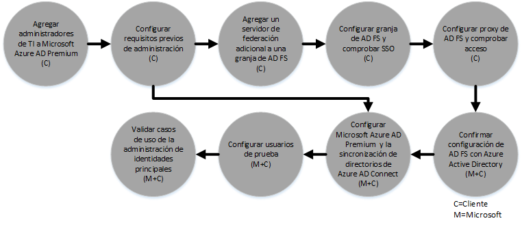

# Proceso del beneficio del centro de FastTrack para Azure Rights Management
Si su organización es apta para el Beneficio del centro de FastTrack para Microsoft Azure Rights Management, puede trabajar de forma remota con los especialistas de Microsoft para preparar su entorno de Azure RMS para usarlo. Para saber si su organización es apta, consulte [Beneficio del centro de FastTrack para Azure Rights Management](../Topic/FastTrack_Center_Benefit_for_Azure_Rights_Management.md).

Este artículo ofrece lo siguiente:

-   [Overview of the onboarding process](#overview_rms)

-   [Expectations for your source environment](#expectations_src_environ_rms)

-   [Phases of the onboarding process](#phases_onboarding_process_rms)

-   [Microsoft responsibilities](#microsoft_responsibilities_rms) de cada fase

-   [Your responsibilities](#your_responsibilities_rms) de cada fase

Esto es lo que puede esperar cuando se complete la incorporación:

-   Se creará el inquilino de Microsoft Azure RMS.

-   Los usuarios con licencia podrán acceder a los servicios de Azure RMS mediante una de las siguientes opciones de identidad:

    -   Identidades de nube (cuentas de Microsoft Azure AD únicas).

    -   Identidades sincronizadas: cuentas de Microsoft Azure AD sincronizadas desde su Active Directory local con la herramienta Azure Active Directory Connect (Azure AD Connect) para clientes con un único bosque o varios bosques de Active Directory.

    -   Identidades federadas, con cuentas de Microsoft Azure AD que están:

        -   Sincronizadas desde Active Directory con la herramienta de Microsoft Azure AD Connect para clientes con una única configuración de bosque de Active Directory.

        -   Federadas con Servicios de federación de Active Directory (AD FS) 2.0 o posteriores de su Active Directory local.

## Información general sobre el proceso de incorporación
La incorporación presenta dos componentes principales:

-   **Capacidades principales**: tareas necesarias para la configuración de inquilinos e integración con Azure AD, si es necesario. Las capacidades principales también proporcionan la línea de base para incorporar otros servicios válidos de Microsoft Online.

-   **Incorporación de servicio**: tareas necesarias para configurar Azure RMS independiente o con la sincronización de directorios de Azure AD Connect o AD FS.

El siguiente diagrama describe la escala de tiempo para el uso del Beneficio del centro de FastTrack.

El proceso básico es el siguiente:

-   El equipo de Microsoft intentará ponerse en contacto con usted en un plazo de 30 días a partir de la fecha de compra de un plan válido. También puede solicitar asistencia desde el [Centro de FastTrack](http://fasttrack.microsoft.com/) si está listo para implementar estos servicios para su organización. Para solicitar asistencia, inicie sesión en el Centro de FastTrack (http://fasttrack.microsoft.com), vaya al panel, seleccione el nombre de su empresa, haga clic en la pestaña Ofertas y haga clic en el botón correspondiente para solicitar asistencia del servicio pertinente.

-   El equipo de Microsoft le ayudará con las capacidades principales y a incorporar cada uno de los servicios válidos una vez.

Todo el soporte técnico de incorporación lo proporcionará de forma remota el personal asignado de Microsoft:

-   Microsoft le ayudará de forma remota con las distintas actividades de incorporación mediante una combinación de herramientas, documentación e instrucciones. Si desea que Microsoft realice ciertas tareas de configuración para usted, puede proporcionar permisos y el acceso apropiado a Microsoft para llevar a cabo estas tareas.

-   El soporte técnico de incorporación lo ofrece el Centro de FastTrack y está disponible durante el horario comercial de una región específica.

-   El soporte técnico de incorporación está disponible en chino tradicional, inglés, francés, alemán, italiano, japonés, portugués (Brasil) y español.

-   El equipo de Microsoft puede trabajar directamente con usted o con su representante, según lo indique.

## Expectativas para su entorno de origen
Es posible que ya disponga de Microsoft Active Directory localmente en su entorno de origen y que desee integrarlo con Microsoft Azure Active Directory para aprovechar la administración de identidades enriquecida desde una sola consola. El Beneficio del centro de FastTrack incluye ayuda para integrar Microsoft Azure Active Directory con su implementación local existente. Si se requiere la integración, el entorno de origen debe estar en un nivel mínimo de la aplicación.

En la tabla siguiente se muestran las expectativas del entorno de origen existente para la incorporación.

|Actividad|Expectativa del entorno de origen|
|-------------|-------------------------------------|
|Capacidades principales|Bosques de Active Directory con el nivel funcional del bosque establecido en Windows Server 2008 o posterior, con la siguiente configuración de bosque:  -   Un único bosque de Active Directory -   Varios bosques de Active Directory **Note:** Para todas las configuraciones de bosques múltiples, la implementación de AD FS está fuera del ámbito del Beneficio del centro de FastTrack.|
|Incorporación de servicio  -   Azure RMS|Active Directory local y el entorno se prepararon para Azure RMS, que incluye la corrección de los problemas identificados que podrían impedir la integración con las funcionalidades de Azure AD y Azure RMS.|

## Fases del proceso de incorporación
La incorporación de Azure RMS tiene cinco fases principales, tal y como se muestra en la ilustración siguiente:

-   Inicio

-   Evaluación

-   Corrección

-   Habilitar

-   Cerrar

Para conocer las tareas detalladas de cada fase, consulte las secciones [Microsoft responsibilities](#microsoft_responsibilities_rms) y [Your responsibilities](#your_responsibilities_rms).

### Fase de inicio
Una vez que haya adquirido el número adecuado de licencias, siga las instrucciones del correo electrónico de confirmación de compra para asociar las licencias al inquilino existente o a un nuevo inquilino. Microsoft comprobará si cumple los requisitos para optar al Beneficio del centro de FastTrack. El equipo de Microsoft intentará ponerse en contacto con usted en un plazo de 30 días a partir de la fecha de compra de un plan válido. También puede solicitar asistencia desde el [Centro de FastTrack](http://fasttrack.microsoft.com/) si está listo para implementar estos servicios para su organización. Para solicitar asistencia, inicie sesión en el Centro de FastTrack (http://fasttrack.microsoft.com), vaya al panel, seleccione el nombre de su empresa, haga clic en la pestaña Ofertas y haga clic en el botón correspondiente para solicitar asistencia del servicio pertinente.

Durante esta fase, explicaremos el proceso de incorporación, comprobaremos los datos y convocaremos una reunión de puesta en marcha.

### Fase de evaluación
Una vez iniciado el proceso de incorporación, Microsoft trabajará con usted para evaluar su entorno de origen y los requisitos. Se ejecutarán herramientas para evaluar su entorno y Microsoft le ayudará a evaluar su Active Directory local, exploradores de Internet, sistemas operativos de dispositivos cliente, DNS, red, infraestructura y sistema de identidad para determinar si se requieren cambios para la incorporación. Según la configuración actual, le presentaremos un plan de corrección para que su entorno de origen reúna los requisitos mínimos para incorporar correctamente Azure RMS. También programaremos llamadas de control pertinentes durante la fase de corrección.

### Fase de corrección
Si es necesario, realizará las tareas del plan de corrección en su entorno de origen para cumplir los requisitos de incorporación de cada servicio.

Antes de comenzar la fase de habilitación, comprobaremos juntos los resultados de las actividades de corrección para asegurarnos de que está listo para continuar.

### Fase de habilitación
Cuando complete todas las actividades de corrección, el proyecto pasará a la configuración de la infraestructura básica de consumo del servicio y al aprovisionamiento de Azure RMS.

**Habilitar la fase: capacidades principales**

Habilitar las capacidades principales implica el aprovisionamiento del servicio y la integración de inquilinos e identidades. También incluye los pasos para establecer una base para incorporar Microsoft Azure RMS.

La incorporación de Azure RMS puede empezar cuando haya finalizado la incorporación principal.

**Fase de habilitación: Azure RMS**

Según sea necesario, el entorno de Azure RMS puede configurarse con la sincronización de directorios de Azure AD Connect y los Servicios de federación de Active Directory (AD FS).

Para los escenarios de Azure RMS que incluyen la sincronización de identidades locales en la nube, le ayudaremos mediante la adición de usuarios y administradores de TI a su suscripción, la configuración de los requisitos previos de administración, la configuración de Azure RMS, la configuración de la sincronización de directorios con Azure AD Connect y los Servicios de federación de Active Directory con Azure AD Connect, la configuración de usuarios de prueba y la validación de los principales casos de uso que realiza del servicio.

El programa de instalación de Azure RMS incluye la habilitación de las siguientes funcionalidades:

-   Habilitación del servicio de RMS

-   Configuración de IRM para Exchange Online y Sharepoint Online

-   Conector Rights Management con Exchange y Sharepoint locales

-   Aplicación de uso compartido de RMS para dispositivos Windows y dispositivos que no son Windows

## Responsabilidades de Microsoft

### General

-   Proporcionar asistencia remota para las actividades de configuración necesarias, como se explica en las descripciones detalladas de cada fase.

-   Proporcionar la documentación y las herramientas de software, las consolas de administración y los scripts necesarios para ayudarle a reducir o eliminar las tareas de configuración.

No es necesario proporcionar acceso y permisos a Microsoft para poder usar el Beneficio del centro de FastTrack. En algunos casos, puede facilitar a Microsoft el acceso y permisos adecuados para realizar actividades específicas en su nombre.

### Fase de inicio

-   Ponerse en contacto con usted en un plazo de 30 días a partir de la compra de licencias aptas para un nuevo inquilino.

-   Definir los servicios elegibles que desea incorporar.

### Fase de evaluación

-   Proporcionar una introducción administrativa.

-   Proporcionar instrucciones sobre:

    -   Necesidades de infraestructura, red y DNS.

    -   Necesidades del cliente (explorador de Internet, sistema operativo cliente y servicios).

    -   Identidad de usuario y aprovisionamiento.

    -   Identificación de los requisitos de sincronización de directorios.

    -   Habilitación de los servicios válidos comprados y definidos como parte de la incorporación.

    -   Identificación de los requisitos necesarios del entorno piloto y de prueba.

-   Establecer la escala de tiempo para las actividades de corrección.

-   Proporcionar una lista de comprobación de correcciones.

### Fase de corrección

-   Celebrar teleconferencias con usted según la programación acordada para revisar el progreso de las actividades de corrección.

-   Ayudar por medio de las herramientas en ejecución a identificar y corregir problemas, así como a interpretar los resultados.

### Fase de habilitación
Proporcionar instrucciones sobre las acciones siguientes:

-   Activar el inquilino de Azure RMS.

-   Configurar puertos de firewall.

-   Configurar DNS para los servicios elegibles.

-   Validar la conectividad con los servicios de Azure RMS.

-   Para un entorno de un bosque único:

    -   Instalación de una sincronización de directorios entre los Servicios de dominio de Active Directory (AD DS) y Azure AD Connect, si es necesario.

    -   Configuración de la sincronización de contraseñas con la herramienta Azure AD Connect.

-   Para entornos de varios bosques:

    -   Instalación de la sincronización de Azure AD Connect y configuración de escenarios con varios bosques. Tenga en cuenta que la sincronización de hash de contraseña y la escritura diferida de contraseñas admiten varios bosques.  Sin embargo, no se admiten otros escenarios de escritura diferida.

    -   Configuración de la sincronización entre bosques de Active Directory local y el directorio de Microsoft Azure AD (Azure Active Directory).

        > [!NOTE]
        > El desarrollo y la implementación de extensiones de reglas personalizadas están fuera del ámbito.

-   Para un bosque único cuando el destino son identidades federadas: instalar y configurar los Servicios de federación de Active Directory (AD FS) para la autenticación de dominio local con Microsoft Azure AD en una configuración de sitio único con tolerancia a errores, si es necesario.

    > [!NOTE]
    > Para todas las configuraciones de bosques múltiples, las implementaciones de AD FS están fuera del ámbito.

-   Probar la función de inicio de sesión único (SSO) si está implementada.

-   Adición de administradores de seguridad de información adicionales para administrar plantillas.

-   Asignación de una cuenta de superusuario para Azure RMS.

-   Licencias para dos usuarios pilotos de Azure RMS.

-   Configuración de dos grupos de distribución de prueba para validar directivas.

-   Configuración de una plantilla personalizada de Azure RMS para su directorio.

-   Instrucciones para la configuración de la integración de SharePoint Online y Exchange Online con Azure RMS, que incluyen:

    -   Configuración y validación de la integración de Exchange Online con Azure RMS.

    -   Configuración de una regla de flujo de correo de prueba para cifrar mensajes confidenciales enviados a destinatarios ajenos a la organización.

    -   Configuración y validación de la protección de SharePoint Online de una biblioteca de prueba que se protegerá con Azure RMS.

-   Configuración de un servidor local con el conector RMS, cuando sea aplicable:

    -   La configuración y validación de la integración de Exchange 2013/2010 local con Azure RMS.

    -   La configuración de una regla de flujo de correo de prueba para cifrar mensajes confidenciales enviados a destinatarios ajenos a la organización mediante el conector.

    -   La configuración y validación de la protección de SharePoint 2013/2010 local de una biblioteca de prueba que se protegerá con Azure RMS.

-   La configuración de la aplicación de uso compartido de RMS para dispositivos Windows y dispositivos que no son Windows.

## Sus responsabilidades
En esta sección se describen algunas de sus responsabilidades durante el proceso de incorporación.

### General

-   Mejoras e integraciones para su inquilino de Azure RMS más allá de las opciones configurables enumeradas en este artículo.

-   Administración general de sus recursos del programa y el proyecto.

-   Administración de comunicaciones de usuario final, documentación, entrenamiento y cambios.

-   Documentación del departamento de soporte técnico y entrenamiento.

-   Elaboración de informes, presentaciones o actas de reunión específicas de su organización.

-   Creación de documentación arquitectónica y técnica específica de su organización.

-   Diseño, obtención, instalación y configuración de hardware y redes.

-   Obtención, instalación y configuración de software.

-   Administración, configuración y aplicación de directivas de seguridad más allá de las creadas para probar la funcionalidad y la configuración de línea de base de los servicios de Azure RMS.

-   Inscripción de cuentas de usuario distintas de las que se usan para probar la funcionalidad y la configuración de línea de base de servicios de Azure RMS.

-   Configuración de red, análisis, validación de ancho de banda, pruebas y supervisión.

-   Administración de un proceso de aprobación de administración de cambios técnicos y creación de documentación complementaria.

-   Modificación del modelo operativo y los manuales de uso.

-   Retirada y eliminación de los entornos de origen y servicios usados previamente por el cliente.

-   Construcción y mantenimiento del entorno de prueba.

-   Instalación de Service Packs y otras actualizaciones necesarias en los servidores de la infraestructura.

-   Suministro y configuración de certificados SSL públicos.

-   Redacción de la declaración de condiciones de uso (CDU) de la organización que se configurará y mostrará en los dispositivos propiedad de los usuarios finales.

### Fase de inicio

-   Trabajar con el equipo de Microsoft para comenzar la incorporación de los servicios válidos.

-   Participar en la reunión de puesta en marcha de contratación, administrar y dirigir a los participantes de su organización, además de confirmar las escalas de tiempo de corrección.

### Fase de evaluación

-   Identificar a las partes interesadas pertinentes (incluido un jefe de proyecto) para completar las actividades de evaluación necesarias.

-   Si lo desea, compartir la pantalla con Microsoft si necesita instrucciones para ejecutar herramientas de evaluación en su entorno o en su suscripción a Azure RMS.

-   Participar en las reuniones para crear la lista de comprobación de correcciones y contribuir al plan general, incluidos los temas de infraestructura, red, administración, preparación de la sincronización de directorios, seguridad de red e identidad federada.

-   Participar en las reuniones para definir el enfoque de aprovisionamiento de usuarios.

-   Participar en las reuniones para planificar la configuración de servicios en línea.

-   Crear un plan de soporte técnico para preparar la migración.

### Fase de corrección

-   Realizar los pasos necesarios para completar las actividades de corrección identificadas en la fase de evaluación.

-   Participar en reuniones de punto de comprobación.

### Fase de habilitación

-   Si lo desea, compartir la pantalla con Microsoft si necesita instrucciones para aplicar cambios en su entorno o en su suscripción a Azure RMS.

-   Administrar los recursos según sea necesario.

-   Configurar elementos relacionados con la red siguiendo las instrucciones de Microsoft.

-   Preparar los directorios y configurar la sincronización de directorios según las instrucciones de Microsoft.

-   Configurar la infraestructura relacionada con la seguridad (por ejemplo, los puertos de firewall) de acuerdo con las instrucciones de Microsoft.

-   Implementar la infraestructura de cliente adecuada.

-   Implementar un enfoque de aprovisionamiento de usuarios siguiendo las instrucciones de Microsoft.

-   Habilitar varios servicios de acuerdo con las instrucciones de Microsoft.

## ¿Desea obtener más información?
Consulte [Microsoft Azure Rights Management](http://products.office.com/business/microsoft-azure-rights-management) y [Enterprise Mobility Suite](http://www.microsoft.com/en-us/server-cloud/products/enterprise-mobility-suite/default.aspx).

