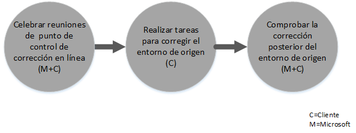
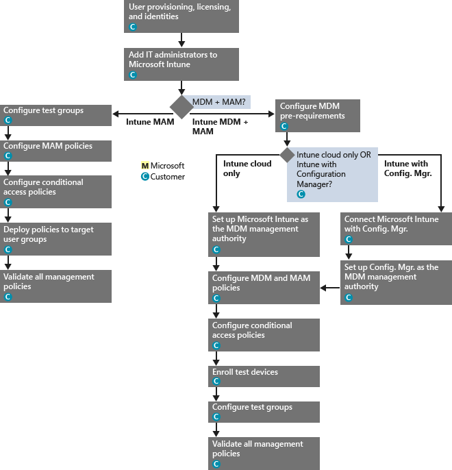

# Proceso del beneficio del Centro de FastTrack para Intune
Si su organización es apta para el beneficio de servicio de Microsoft Intune, puede trabajar de forma remota con los especialistas de Microsoft para preparar su entorno de Microsoft Intune para el uso.

Microsoft Intune forma parte de Enterprise Mobility Suite (EMS), también de Microsoft, y proporciona funcionalidades de Enterprise Mobility Management (EMM), incluidas la administración de dispositivos móviles (MDM) y la administración de aplicaciones móviles (MAM).  Puede usar Microsoft Intune para que sus empleados sean más productivos en dispositivos móviles mediante el aprovisionamiento y la configuración de los dispositivos y la implementación de aplicaciones móviles.  Además, gracias a la supervisión de la conformidad de los dispositivos, la protección de los datos y las aplicaciones móviles y la integración con Azure AD para controlar el acceso a los servicios empresariales, puede usar Microsoft Intune para proteger los datos de su empresa.

Para saber si su organización es apta, consulte [Descripción del beneficio de servicio de Microsoft Intune](../Topic/FastTrack_Center_Benefit_for_Intune.md). Si cree que le puede interesar preparar su entorno para otros servicios de Enterprise Mobility Suite, consulte [Beneficio de incorporación y migración a Microsoft FastTrack para Enterprise Mobility Suite](../Topic/FastTrack_Center_Benefit_for_Enterprise_Mobility_Suite.md).

**¿Quiere obtener información acerca de Microsoft FastTrack para Office 365? Consulte** [Beneficio del centro FastTrack para Office 365](https://technet.microsoft.com/library/office-365-onboarding-benefit.aspx).

Este artículo proporciona la siguiente información acerca del beneficio de servicio de Microsoft Intune:

-   [Overview of the onboarding process](#overview_onboarding_process)

-   [Expectations for your source environment](#expectations_src_environ)

-   [Phases of the onboarding process](#phases_onboarding_process)

-   [Microsoft responsibilities](#microsoft_responsibilities) de cada fase

-   [Your responsibilities](#your_responsibilities) de cada fase

Esto es lo que puede esperar cuando se complete la incorporación:

-   Se creará su inquilino de Microsoft Online Services.

-   Los usuarios con licencia podrán acceder al servicio de Microsoft Intune mediante una de las siguientes opciones de identidad:

    -   Identidades de nube (cuentas de Microsoft Online Services únicas).

    -   Identidades sincronizadas: cuentas de Microsoft Intune sincronizadas a partir de su Active Directory local con Azure Active Directory Connect (servicios de sincronización):

        -   Para los clientes con un entorno de un único bosque de Active Directory.

        -   Para clientes con topologías de varios bosques de Active Directory compatibles.

-   Identidades federadas: cuentas de Microsoft Intune:

    -   Sincronizadas desde Active Directory con la herramienta Microsoft Azure Active Directory Connect para los clientes con una única configuración de bosque de Active Directory o para clientes con un único bosque de cuenta de Active Directory (también conocido como un "bosque de inicio de sesión") y una única configuración de bosque de recursos de Active Directory.

    -   Federadas con el rol de Windows Server 2012 R2 Active Directory Federation Services de su Active Directory local o federado con un Active Directory Federation Services (AD FS) 2.0 o posterior de su Active Directory local.

## Información general sobre el proceso de incorporación
La incorporación presenta dos componentes principales:

-   **Capacidades principales**: tareas necesarias para la configuración de inquilinos e integración con Azure AD, si es necesario. Las capacidades principales también proporcionan la línea de base para incorporar otros servicios.

-   **Incorporación de servicio**: tareas necesarias para configurar Microsoft Intune.

En el siguiente diagrama se describe la secuencia de eventos para usar el beneficio del Centro de FastTrack.

El proceso básico es el siguiente:

-   El equipo del Centro de FastTrack intentará ponerse en contacto con usted en un plazo de 30 días a partir de la fecha de compra de un plan válido. También puede solicitar asistencia desde el [Centro de FastTrack](http://fasttrack.microsoft.com/) si está listo para implementar estos servicios para su organización. Para solicitar asistencia con Microsoft Intune, Azure Active Directory Premium o Azure Rights Management Premium, inicie sesión en el [Centro de FastTrack](http://fasttrack.microsoft.com/), vaya al panel, seleccione el nombre de su empresa, haga clic en la pestaña Ofertas y, luego, en el botón Solicitar asistencia.

-   El equipo del Centro de FastTrack le ayudará con las capacidades principales y, a continuación, con la primera incorporación de cada uno de los servicios elegibles.

Todo el soporte técnico de incorporación lo proporcionará de forma remota el personal asignado de Microsoft:

-   Microsoft le ayudará de forma remota con las distintas actividades de incorporación mediante una combinación de herramientas, documentación e instrucciones.

-   El soporte técnico de incorporación lo ofrece el Centro de FastTrack y está disponible durante el horario comercial de una región específica.

-   El soporte técnico de incorporación está disponible en chino tradicional, inglés, francés, alemán, italiano, japonés, portugués (Brasil) y español.

-   El equipo de Microsoft puede trabajar directamente con usted o a través de su representante.

## Expectativas para su entorno de origen
Es posible que ya tenga servicios en su entorno de origen que desee comenzar a usar o integrar con el servicio de Microsoft Intune. Para algunos servicios, el beneficio del Centro de FastTrack para Intune incluyen la ayuda para configurar cierto nivel de integración con el entorno de origen. Si se requiere la integración, el entorno de origen debe estar en un nivel mínimo de la aplicación.

En la tabla siguiente se muestran las expectativas del entorno de origen existente para la incorporación.

|Actividad|Expectativa del entorno de origen|
|-------------|-------------------------------------|
|Capacidades principales|Bosques de Active Directory con el nivel funcional del bosque establecido en Windows Server 2008 o posterior, con la siguiente configuración de bosque:  -   Un único bosque de Active Directory -   Varios bosques de Active Directory **Note:** En el caso de las configuraciones de varios bosques, la implementación de AD FS no está incluida en el beneficio del Centro de FastTrack.|
|Incorporación de servicio  -   Microsoft Intune -   Microsoft Intune integrado con System Center Configuration Manager|Para la administración de dispositivos con System Center Configuration Manager 2012 R2 o una versión posterior en conexión con Microsoft Intune, los administradores de TI deberán seguir la [Lista de comprobación de administrador: Configuración de Configuration Manager para administrar dispositivos móviles con Microsoft Intune](https://technet.microsoft.com/library/jj943763.aspx). **Note:** El beneficio de servicio no incluye asistencia para configurar ni actualizar System Center Configuration Manager con los requisitos mínimos necesarios para Microsoft Intune integrado con System Center Configuration Manager.|

## Fases del proceso de incorporación
La incorporación consta de cuatro fases principales:

-   Inicio

-   Evaluación

-   Corrección

-   Habilitar

Para conocer las tareas detalladas de cada fase, consulte las secciones [Microsoft responsibilities](#microsoft_responsibilities) y [Your responsibilities](#your_responsibilities).

### Fase de inicio
Una vez que haya adquirido el número y los tipos adecuados de licencias, siga las instrucciones del correo electrónico de confirmación de compra para asociar las licencias al inquilino existente o a un nuevo inquilino. El equipo del Centro de FastTrack comprobará si cumple los requisitos para optar al beneficio de servicio que ofrece el Centro de FastTrack. El equipo de Microsoft intentará ponerse en contacto con usted en un plazo de 30 días a partir de la fecha de compra de un plan válido. También puede solicitar asistencia desde el [Centro de FastTrack](http://fasttrack.microsoft.com/) si está listo para implementar estos servicios para su organización. Para solicitar asistencia con Microsoft Intune, Azure Active Directory Premium o Azure Rights Management Premium, inicie sesión en el [Centro de FastTrack](http://fasttrack.microsoft.com/), vaya al panel, seleccione el nombre de su empresa, haga clic en la pestaña Ofertas y, luego, en el botón Solicitar asistencia.

Durante esta fase, explicaremos el proceso de incorporación, comprobaremos los datos y convocaremos una reunión de puesta en marcha.

### Fase de evaluación
Una vez iniciado el proceso de incorporación, Microsoft trabajará con usted para evaluar su entorno de origen y los requisitos. Se ejecutarán herramientas para evaluar su entorno y Microsoft le ayudará a evaluar sus exploradores de Internet, sistemas operativos cliente, DNS, red, infraestructura y sistema de identidad para determinar si se requieren cambios para la incorporación. Según la configuración actual, le presentaremos un plan de corrección para que su entorno de origen reúna los requisitos mínimos para incorporar correctamente Microsoft Intune. También programaremos llamadas de control pertinentes durante la fase de corrección.

### Fase de corrección
Si es necesario, realizará las tareas del plan de corrección en su entorno de origen para cumplir los requisitos de incorporación de cada servicio.

Antes de comenzar la fase de habilitación, comprobaremos juntos los resultados de las actividades de corrección para asegurarnos de que está listo para continuar.

### Fase de habilitación
Cuando complete todas las actividades de corrección, el proyecto pasará a la configuración de la infraestructura básica de consumo del servicio y al aprovisionamiento de Microsoft Intune.

**Habilitar la fase: capacidades principales**

Habilitar las capacidades principales implica el aprovisionamiento del servicio y la integración de inquilinos e identidades. También incluye los pasos para establecer una base para incorporar Microsoft Intune.

La incorporación de Microsoft Intune puede empezar cuando haya finalizado la habilitación de las capacidades principales.

**Fase de habilitación: Microsoft Intune**

En el caso de Microsoft Intune, y según el dispositivo móvil y las necesidades de administración de aplicaciones móviles, le guiaremos durante la preparación para usar Microsoft Intune para administrar dispositivos. Los pasos exactos dependerán del entorno de origen y pueden incluir:

-   Concesión de licencias a los usuarios finales. Cuando sea necesario, también proporcionaremos asistencia sobre cómo activar las licencias por volumen para su inquilino de servicio en la nube de Microsoft.

-   Configurar identidades para su uso con Microsoft Intune mediante el aprovechamiento de las identidades de Active Directory local o en la nube.

-   Agregar usuarios a su suscripción de Microsoft Intune, definir roles de administrador de TI y crear grupos de usuarios y dispositivos.

-   Configuración de la entidad de administración de dispositivos móviles, según sus necesidades de administración:

    -   Establecer Microsoft Intune como entidad de MDM en los casos en que Microsoft Intune es la única solución de MDM o cuando se usa con la administración de dispositivos móviles para Office 365.

    -   Si tiene una implementación existente de System Center Configuration Manager y desea para ampliar sus capacidades de administración con Microsoft Intune, establezca Configuration Manager como entidad de MDM.

        > [!NOTE]
        > Si solo desea sacar partido de la administración de aplicaciones móviles en dispositivos de propiedad, en dispositivos compartidos o en dispositivos de tipo quiosco de sus usuarios finales, no es necesario configurar ninguna entidad de MDM.

-   Si la administración de dispositivos móviles está incluida, le ofreceremos instrucciones para lo siguiente:

    -   Configurar grupos de prueba que se usarán para validar las directivas de administración de MDM.

    -   Configurar directivas de administración de MDM y servicios como los siguientes:

        -   Implementación de aplicaciones para cada plataforma compatible mediante vínculos web o vínculos profundos.

        -   Directivas de acceso condicional.

        -   Implementación de perfiles de correo electrónico.

        -   Configurar Microsoft Intune Exchange Connector, si corresponde.

    -   Inscribir hasta dos dispositivos de prueba de cada [plataforma compatible](https://technet.microsoft.com/library/dn600287.aspx) en Microsoft Intune o Configuration Manager con el servicio de Microsoft Intune.

    -   Usar informes de inventario de software y hardware.

-   Si la administración de aplicaciones móviles (MAM) está incluida, o bien si lo que quiere es complementar su solución existente de MDM de Microsoft o de terceros con directivas de MAM, le proporcionamos orientación con lo siguiente:

    -   Configurar directivas de MAM para cada plataforma compatible.

    -   Configurar directivas de acceso condicional para aplicaciones administradas.

    -   Establecer como destino los grupos de usuarios adecuados con las directivas de MAM anteriores.

    -   Usar los informes de uso de las aplicaciones administradas.

-   Si la administración de equipos está incluida, le ofreceremos instrucciones para lo siguiente:

    -   Instalar el software de cliente de Intune, cuando sea necesario.

    -   Usar los informes de hardware y software disponibles en Intune.

## Responsabilidades de Microsoft
En esta sección se describen algunas de las responsabilidades de Microsoft durante el proceso de incorporación.

### General

-   Proporcionar asistencia remota para las actividades de configuración necesarias, como se explica en las descripciones detalladas de cada fase.

-   Proporcionar la documentación y las herramientas de software, las consolas de administración y los scripts necesarios para ayudarle a reducir o eliminar las tareas de configuración.

### Fase de inicio

-   Ponerse en contacto con usted en un plazo de 30 días a partir de la compra de licencias aptas para un nuevo inquilino.

-   Trabajar con el usuario para comenzar con la incorporación.

-   Definir los servicios elegibles que desea incorporar.

### Fase de evaluación

-   Proporcionar una introducción administrativa.

-   Proporcionar instrucciones sobre:

    -   Necesidades de infraestructura, red y DNS.

    -   Necesidades del cliente (explorador de Internet, sistema operativo cliente y servicios).

    -   Identidad de usuario y aprovisionamiento.

    -   Habilitar los servicios elegibles que se han comprado y definido como parte de la incorporación.

-   Establecer la escala de tiempo para las actividades de corrección.

-   Proporcionar una lista de comprobación de correcciones.

### Fase de corrección

-   Celebrar teleconferencias con usted según la programación acordada para revisar el progreso de las actividades de corrección.

-   Ayudar por medio de las herramientas en ejecución a identificar y corregir problemas, así como a interpretar los resultados.

### Fase de habilitación
Proporcionar instrucciones sobre las acciones siguientes:

-   Activar el inquilino de Microsoft Online Services.

-   Configurar protocolos TCP/IP y puertos de firewall.

-   Configurar DNS para los servicios elegibles.

-   Validar la conectividad a Microsoft Online Services.

-   Para un entorno de un bosque único:

    -   Instalación de un servidor de sincronización de directorios entre los Servicios de dominio de Active Directory (AD DS) y los servicios de Microsoft Online Services elegibles, si es necesario.

    -   Configurar la sincronización de contraseña (hash de contraseña) para Microsoft Intune (Azure Active Directory) con la herramienta Azure Active Directory Connect.

        > [!NOTE]
        > El desarrollo y la implementación de extensiones de reglas personalizadas están fuera del ámbito.

-   Para un bosque único cuando el destino son identidades federadas: Instalar y configurar los Servicios de federación de Active Directory (AD FS) para la autenticación de dominio local con Microsoft Intune en una configuración de sitio único con tolerancia a errores, si es necesario.

    > [!NOTE]
    > Para todas las configuraciones de bosques múltiples, las implementaciones de AD FS están fuera del ámbito.

-   Probar la función de inicio de sesión único (SSO) si está implementada.

#### Fase de habilitación: Microsoft Intune
Proporcionar instrucciones sobre:

-   Concesión de licencias a los usuarios finales. Cuando sea necesario, también proporcionaremos asistencia sobre cómo activar las licencias por volumen para su inquilino de servicio en la nube de Microsoft.

-   Configurar identidades para su uso con Microsoft Intune mediante el aprovechamiento de las identidades de Active Directory local o en la nube.

-   Agregar usuarios a su suscripción de Microsoft Intune, definir roles de administrador de TI y crear grupos de usuarios y dispositivos.

-   Configuración de la entidad de administración de dispositivos móviles, según sus necesidades de administración:

    -   Establecer Microsoft Intune como entidad de MDM en los casos en que Microsoft Intune es la única solución de MDM o cuando se usa con la administración de dispositivos móviles para Office 365.

    -   Si tiene una implementación existente de System Center Configuration Manager y desea para ampliar sus capacidades de administración con Microsoft Intune, establezca Configuration Manager como entidad de MDM.

        > [!NOTE]
        > Si solo desea sacar partido de la administración de aplicaciones móviles en dispositivos de propiedad, en dispositivos compartidos o en dispositivos de tipo quiosco de sus usuarios finales, no es necesario configurar ninguna entidad de MDM.

-   Si la administración de dispositivos móviles está incluida, le ofreceremos instrucciones para lo siguiente:

    -   Configurar grupos de prueba que se usarán para validar las directivas de administración de MDM.

    -   Configurar directivas de administración de MDM y servicios como los siguientes:

        -   Implementación de aplicaciones para cada plataforma compatible mediante vínculos web o vínculos profundos.

        -   Directivas de acceso condicional.

        -   Implementación de perfiles de correo electrónico.

        -   Configurar Microsoft Intune Exchange Connector, si corresponde.

    -   Inscribir hasta dos dispositivos de prueba de cada plataforma compatible en Microsoft Intune o Configuration Manager con el servicio de Microsoft Intune.

    -   Usar informes de inventario de software y hardware.

-   Si la administración de aplicaciones móviles (MAM) está incluida, o bien si lo que quiere es complementar su solución existente de MDM de terceros con directivas de MAM, le proporcionamos orientación con lo siguiente:

    -   Configurar directivas de MAM para cada plataforma compatible.

    -   Configurar directivas de acceso condicional para aplicaciones administradas.

    -   Establecer como destino los grupos de usuarios adecuados con las directivas de MAM anteriores.

    -   Usar los informes de uso de las aplicaciones administradas.

-   Si la administración de equipos está incluida, le ofreceremos instrucciones para lo siguiente:

    -   Instalar el software de cliente de Intune, cuando sea necesario.

    -   Usar los informes de hardware y software disponibles en Intune.

## Sus responsabilidades
En esta sección se describen algunas de sus responsabilidades durante el proceso de incorporación.

### General

-   Mejoras e integraciones para su inquilino de Microsoft Online Services más allá de las opciones configurables enumeradas en este artículo.

-   Administración general de sus recursos del programa y el proyecto.

-   Administración de comunicaciones de usuario final, documentación, entrenamiento y cambios.

-   Documentación del departamento de soporte técnico y entrenamiento.

-   Elaboración de informes, presentaciones o actas de reunión específicas de su organización.

-   Creación de documentación arquitectónica y técnica específica de su organización.

-   Diseño, obtención, instalación y configuración de hardware y redes.

-   Obtención, instalación y configuración de software.

-   Configuración, empaquetado y distribución del software de cliente necesario para Microsoft Intune.

-   Activación de dispositivos móviles.

-   Configuración de red, análisis, validación de ancho de banda, pruebas y supervisión.

-   Administración de un proceso de aprobación de administración de cambios técnicos y creación de documentación complementaria.

-   Especificación y definición de directivas de grupo para la administración de usuarios, estaciones de trabajo y servidores.

-   Modificación del modelo operativo y los manuales de uso.

-   Configuración de la autenticación multifactor.

-   Baja y eliminación de entornos de origen (así como otras soluciones de administración de equipos o dispositivos).

-   Construcción y mantenimiento del entorno de prueba.

-   Instalación de Service Packs y otras actualizaciones necesarias en los servidores de la infraestructura.

-   Suministro y configuración de certificados SSL públicos.

-   Redacción de las condiciones de uso (CDU) de la organización que se configurarán y mostrarán en los portales de empresa de Microsoft Intune a los que puedan acceder los usuarios finales.

### Fase de inicio

-   Trabajar con el equipo de Microsoft para comenzar con la incorporación de los servicios aptos.

-   Participar en la reunión de puesta en marcha de contratación, administrar y dirigir a los participantes de su organización, además de confirmar las escalas de tiempo de corrección.

### Fase de evaluación

-   Identificar a las partes interesadas pertinentes (incluido un jefe de proyecto) para completar las actividades de evaluación necesarias.

-   Si lo desea, compartir la pantalla con Microsoft si necesita instrucciones al ejecutar herramientas de evaluación en su entorno o en la suscripción de Microsoft Intune.

-   Participar en las reuniones para crear la lista de comprobación de correcciones y contribuir al plan general, incluidos los temas de infraestructura, red, administración, preparación de la sincronización de directorios, seguridad de red e identidad federada.

-   Participar en las reuniones para definir el enfoque de aprovisionamiento de usuarios.

-   Participar en las reuniones para planificar la configuración de servicios en línea.

-   Crear un plan de soporte técnico para preparar la migración.

### Fase de corrección

-   Realizar los pasos necesarios para completar las actividades de corrección identificadas en la fase de evaluación.

-   Participar en reuniones de punto de comprobación.

### Fase de habilitación

-   Si lo desea, compartir la pantalla con Microsoft si necesita instrucciones al realizar cambios en su entorno o en la suscripción de Microsoft Online Services.

-   Administrar los recursos según sea necesario.

-   Configurar elementos relacionados con la red siguiendo las instrucciones de Microsoft.

-   Preparar los directorios y configurar la sincronización de directorios según las instrucciones de Microsoft.

-   Configurar la infraestructura relacionada con la seguridad (por ejemplo, los puertos de firewall) de acuerdo con las instrucciones de Microsoft.

-   Implementar la infraestructura de cliente adecuada.

-   Implementar un enfoque de aprovisionamiento de usuarios siguiendo las instrucciones de Microsoft.

-   Habilitar varios servicios de acuerdo con las instrucciones de Microsoft.

-   Trabajar con Microsoft para completar la incorporación de todos los servicios elegibles en un plazo de 12 meses desde el inicio de la incorporación.

-   Al habilitar la administración de equipos o dispositivos móviles con Microsoft Intune, use dispositivos de prueba para habilitar las directivas de administración a través de Microsoft Intune. Si no tiene dispositivos de prueba disponibles, los clientes serán responsables de realizar copias de seguridad y, si es necesario, de restaurar todo el contenido de los dispositivos usados durante la fase de habilitación de Microsoft Intune.

-   Seleccionar hasta dos aplicaciones para cada plataforma compatible con Microsoft Intune que puedan implementarse a través de vínculos web o vínculos profundos.

-   Administrar, configurar y aplicar directivas de seguridad más allá de las que se utilizan para probar la funcionalidad y la configuración de línea de base de los servicios de Microsoft Intune.

## ¿Desea obtener más información?
Consulte [Microsoft Intune](http://www.microsoft.com/en-us/server-cloud/products/microsoft-intune/default.aspx) y [Enterprise Mobility Suite](http://www.microsoft.com/en-us/server-cloud/products/enterprise-mobility-suite/default.aspx).

